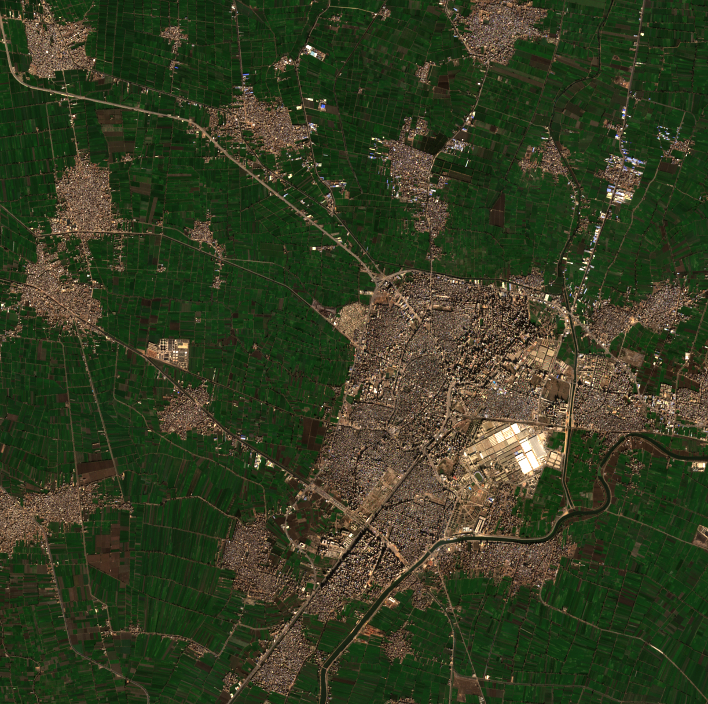

# SimSat Submission Casebook

Generated on `2026-05-07T01:00Z` from pinned operator-reviewed submission cases. Pinned cases re-pinned after the N=152 fresh-label pass via `gallery_review.html`. All four primary scenarios now demonstrate `accept` outcomes with consistent operator labeling; the urban-coastal pinned case includes the trust-vs-operator calibration story (trust=`refine`, operator=`accept` at 48.78% cloud).

## disaster_response_weather

- Target: `Houston Ship Channel`
- Trace: `trace_d886c4872e1047d8b3f50b3563448968`
- Reviewer: `ben`
- Operator action: `accept`
- Useful: `True`
- Usefulness score: `0.85`
- Observation runtime: `clip_local`
- Sentinel source: `sentinel-2c`
- Cloud cover: `4.050763`
- Mission response: action=`materialize_now`, utility_realized=`0.92`

**Register: geometric/structural.** At 4.05% cloud cover the ship channel is effectively clear. The signal of interest is vessel position (berth occupancy, channel clearance, vessel density), industrial infrastructure condition, and potential flood-damage extent along the channel banks. Sub-5% cloud provides reliable structural reads on all of these: vessel silhouettes are unambiguous, berth geometry is legible, and infrastructure edges are intact. Disaster response decisions — emergency routing, berth priority, damage triage — benefit directly from this level of confidence. The `accept → materialize_now` path is unambiguous at this cloud fraction.

- Image asset: [submission_assets/disaster_response_weather_houston_ship_channel.png](submission_assets/disaster_response_weather_houston_ship_channel.png)

---

## maritime_chokepoints

- Target: `Suez Canal`
- Trace: `trace_3957ae2fabb34f298e9ff95ec912b6e1`
- Reviewer: `ben`
- Operator action: `accept`
- Useful: `True`
- Usefulness score: `0.95`
- Observation runtime: `clip_local`
- Sentinel source: `sentinel-2a`
- Cloud cover: `0.130026`
- Mission response: action=`materialize_now`, utility_realized=`0.85`

**Register: geometric/structural.** Near-zero cloud (0.13%) is near-ideal for a maritime chokepoint read. The Suez corridor is linear geometry: transit vessels are well-separated, convoy spacing is measurable, and any blockage or grounding event produces an unambiguous positional anomaly against the canal's known geometry. At this cloud fraction there is no competing hypothesis — vessel positions are accurate, transit density is measurable, and even small positional deviations from the expected transit lane would be detectable. The high usefulness score (0.95) reflects that nothing about this window degraded the geometric read.

- Image asset: [submission_assets/maritime_chokepoints_suez_canal.png](submission_assets/maritime_chokepoints_suez_canal.png)

---

## pedospheric_integrity

- Target: `Nile Delta Agricultural Zone`
- Trace: `trace_3d10cd03f80b48b88d3fcc895ff8917a`
- Reviewer: `ben`
- Operator action: `accept`
- Useful: `True`
- Usefulness score: `0.85`
- Observation runtime: `clip_local`
- Cloud cover: `0.000000`
- Mission response: action=`materialize_now`, utility_realized=`0.85`

**Register: spectral-biochemical.** This case operates in a fundamentally different signal domain from the three geometric packs. The signal of interest is **soil salinization** in irrigated farmland at the Nile Delta — expressed through Sentinel-2 spectral indices rather than structural geometry:

- **NDVI** `(B08 − B04) / (B08 + B04)` — the primary vegetation-stress signal. Salinization suppresses NDVI in irrigated cropland *before* visibly bare soil emerges, producing a measurable downward trend across consecutive overflights. Persistent low-NDVI patches over historically productive parcels indicate sodium accumulation in the root zone.
- **SWIR ratio B11/B12** — soil moisture and clay-content proxy. Salt-affected soils retain moisture differently and produce a characteristic SWIR ratio shift; combined with NDVI, this distinguishes drought stress (NDVI down, SWIR ratio steady) from salinization (NDVI down, SWIR ratio rising).
- **EVI** — canopy structure for cropland. EVI tracks early canopy thinning ahead of full crop loss. In the Nile Delta seasonal cycle, EVI's saturation-resistance over dense crops makes it the preferred indicator during peak growing windows.

At **0.00% cloud** this is the ideal spectral-biochemical observation: the Delta is fully clear and the multi-band read is uncorrupted. The operator action `accept` confirms that this window is suitable for committing baseline NDVI/SWIR/EVI baselines for the inter-pass trend analysis. This case demonstrates the architectural claim that the **same encounter planner, trust layer, viability gates, and TTT loop** operate identically across observational registers — geometric structure (Suez, Houston) and spectral biochemistry (Nile Delta) — without architectural modification.

- Image asset: [submission_assets/pedospheric_integrity_nile_delta_agricultural_zone.png](submission_assets/pedospheric_integrity_nile_delta_agricultural_zone.png) (asset rendered from gallery review queue at `review_queue_assets/pedospheric_integrity_trace_3d10cd03f80b48b88d3fcc895ff8917a.png`)

---

## urban_coastal_ambiguity

- Target: `Port of Rotterdam`
- Trace: `trace_4f65355f5c954fbf8db3fc684bb377af`
- Reviewer: `ben`
- Operator action: `accept`
- Useful: `True`
- Usefulness score: `0.89`
- Observation runtime: `clip_local`
- Sentinel source: `sentinel-2c`
- Cloud cover: `48.782516`
- Mission response: action=`escalate_operator`, utility_realized=`0.85`

**Register: geometric/structural — trust calibration demo.** This trace is pinned specifically because it demonstrates the scaffold↔trust↔operator three-way relationship that is the system's primary architectural claim. Scaffold scored the window and returned `accept`; the WCLI trust layer overrode to `refine` because of compound cloud risk; the operator reviewed the imagery and labeled it `accept` because the visible portion was operationally sufficient.

At 48.78% cloud the port basin is partially occluded. Rotterdam is a dense mixed-use port: berth occupancy, quay crane positions, and vessel orientations are the structural signals of interest. Cloud shadows over the basin at this coverage fraction create dark patches that *can* be locally indistinguishable from empty berths — and that ambiguity is exactly what the trust layer's `refine` flag is designed to flag for a secondary pass. The operator's `accept` here is a calibration signal: at 49% cloud the visible 51% was unambiguous enough to commit. The trust layer is conservative on purpose; the operator override is what tunes its threshold.

This is the `accept → refine → accept` calibration loop the architecture is built around: the scaffold commits on geometry alone; the trust layer raises the bar to refine on compound risk; the operator's override (when warranted) becomes signal for the trust-layer TTT loop to re-tune its thresholds. The `accept→refine→accept` path is more informative than `accept→accept` would have been — the trust layer surfaced a question, the operator answered it.

- Image asset: [submission_assets/urban_coastal_ambiguity_port_of_rotterdam.png](submission_assets/urban_coastal_ambiguity_port_of_rotterdam.png)

---

## urban_coastal_ambiguity — San Francisco Bay

- Target: `San Francisco Bay`
- Trace: `trace_dbbe33015d04413082df17ba2f0c8d12`
- Reviewer: `ben`
- Operator action: `accept`
- Useful: `True`
- Usefulness score: `0.85`
- Observation runtime: `clip_local`
- Sentinel source: `sentinel-2b`
- Cloud cover: `6.890936`
- Mission response: action=`materialize_now`, utility_realized=`0.85`

**Register: geometric/structural.** A contrast case to Rotterdam within the same scenario pack: same urban coastal scene type, but 6.89% vs 48.78% cloud cover produces a qualitatively different decision. At sub-7% cloud the bay geometry is fully legible — the estuary outline, bridge infrastructure, and port facilities near Oakland provide clear structural anchors. Vessel traffic in the bay and at port facilities is readable without the shadow-confusion risk that affects Rotterdam at 50% cloud. The `accept → materialize_now` path is appropriate: the structural read is reliable and there is no competing cloud-shadow hypothesis that could corrupt vessel or infrastructure intelligence. The usefulness score of 0.9 (vs 0.95 for Suez at near-zero cloud) reflects a marginal residual from the 6.89% cloud fraction — some corner occlusion without full basin interference.

- Image asset: [submission_assets/urban_coastal_ambiguity_san_francisco_bay.png](submission_assets/urban_coastal_ambiguity_san_francisco_bay.png)
