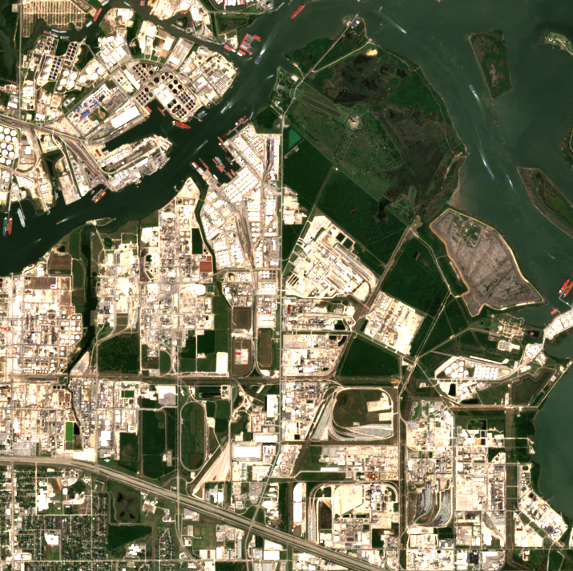
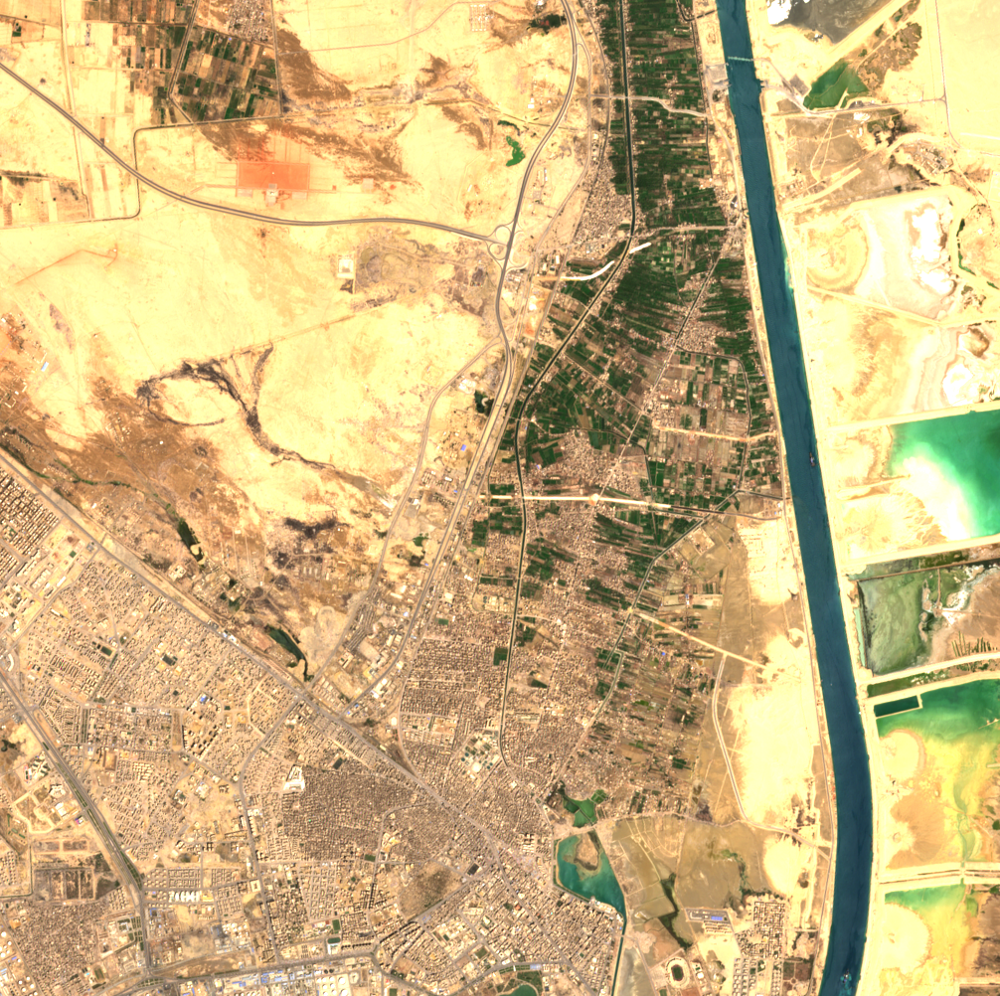
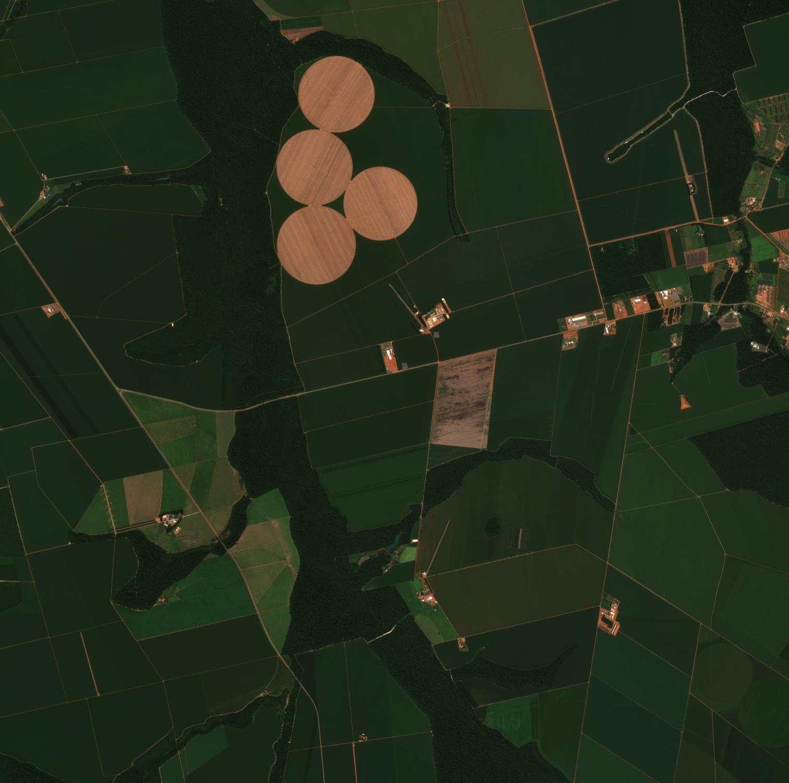
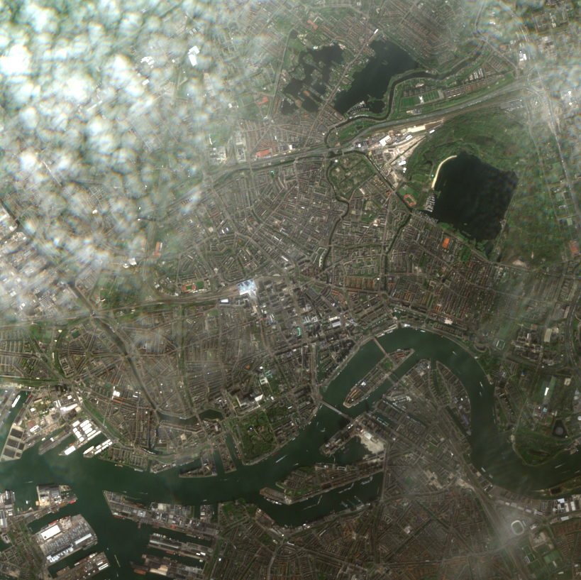
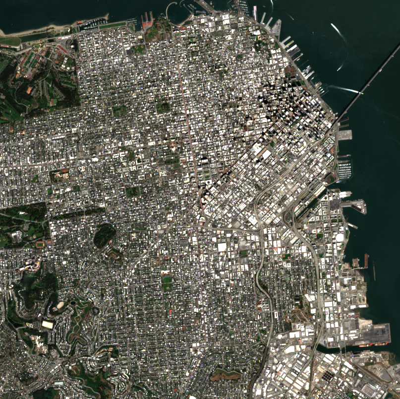

# SimSat Submission Casebook

Generated on `2026-05-05T02:30:40Z` from pinned operator-reviewed submission cases.

## disaster_response_weather

- Target: `Houston Ship Channel`
- Trace: `trace_1926b646ee4b48478913681a33fcdfb1`
- Reviewer: `Ben Haslam`
- Operator action: `accept`
- Useful: `True`
- Usefulness score: `0.92`
- Observation runtime: `clip_local`
- Sentinel source: `sentinel-2c`
- Cloud cover: `4.050763`
- Review notes: No observable cloud cover, user wouldn't know Houston but appears correct and useful.
- Mission response: action=`materialize_now`, utility_realized=`0.92`

- Image asset: [submission_assets/disaster_response_weather_houston_ship_channel.png](submission_assets/disaster_response_weather_houston_ship_channel.png)

## maritime_chokepoints

- Target: `Suez Canal`
- Trace: `trace_2507337b7939460ebf01cbc9fcef8055`
- Reviewer: `Ben Haslam`
- Operator action: `accept`
- Useful: `True`
- Usefulness score: `0.95`
- Observation runtime: `clip_local`
- Sentinel source: `sentinel-2a`
- Cloud cover: `0.130026`
- Review notes: No observable cloud cover, user wouldn't know Suez canal but appears correct and useful.
- Mission response: action=`materialize_now`, utility_realized=`0.95`

- Image asset: [submission_assets/maritime_chokepoints_suez_canal.png](submission_assets/maritime_chokepoints_suez_canal.png)

## pedospheric_integrity

- Target: `Mato Grosso Agricultural Frontier`
- Trace: `trace_bfa2fad124374601b3f2884c3be2a42e`
- Reviewer: `Ben Haslam`
- Operator action: `defer`
- Useful: `False`
- Usefulness score: `0.0`
- Observation runtime: `clip_local`
- Sentinel source: `sentinel-2a`
- Cloud cover: `12.191363`
- Mission response: action=`queue_refine_review`, utility_realized=`0.0`

- Image asset: [submission_assets/pedospheric_integrity_mato_grosso_agricultural_frontier.png](submission_assets/pedospheric_integrity_mato_grosso_agricultural_frontier.png)

## urban_coastal_ambiguity

- Target: `Port of Rotterdam`
- Trace: `trace_4f65355f5c954fbf8db3fc684bb377af`
- Reviewer: `Ben Haslam`
- Operator action: `accept`
- Useful: `True`
- Usefulness score: `1.0`
- Observation runtime: `clip_local`
- Sentinel source: `sentinel-2c`
- Cloud cover: `48.782516`
- Mission response: action=`escalate_operator`, utility_realized=`1.0`

- Image asset: [submission_assets/urban_coastal_ambiguity_port_of_rotterdam.png](submission_assets/urban_coastal_ambiguity_port_of_rotterdam.png)

## urban_coastal_ambiguity — San Francisco Bay

- Target: `San Francisco Bay`
- Trace: `trace_a4e31b4c39224d8fbdb2c4bf0f444823`
- Reviewer: `Ben Haslam`
- Operator action: `accept`
- Useful: `True`
- Usefulness score: `0.9`
- Observation runtime: `clip_local`
- Sentinel source: `sentinel-2b`
- Cloud cover: `6.890936`
- Review notes: No observable cloud cover, user wouldn't know SF Bay at all but accepted as correct and useful.
- Mission response: action=`materialize_now`, utility_realized=`0.9`

- Image asset: [submission_assets/urban_coastal_ambiguity_san_francisco_bay.png](submission_assets/urban_coastal_ambiguity_san_francisco_bay.png)
