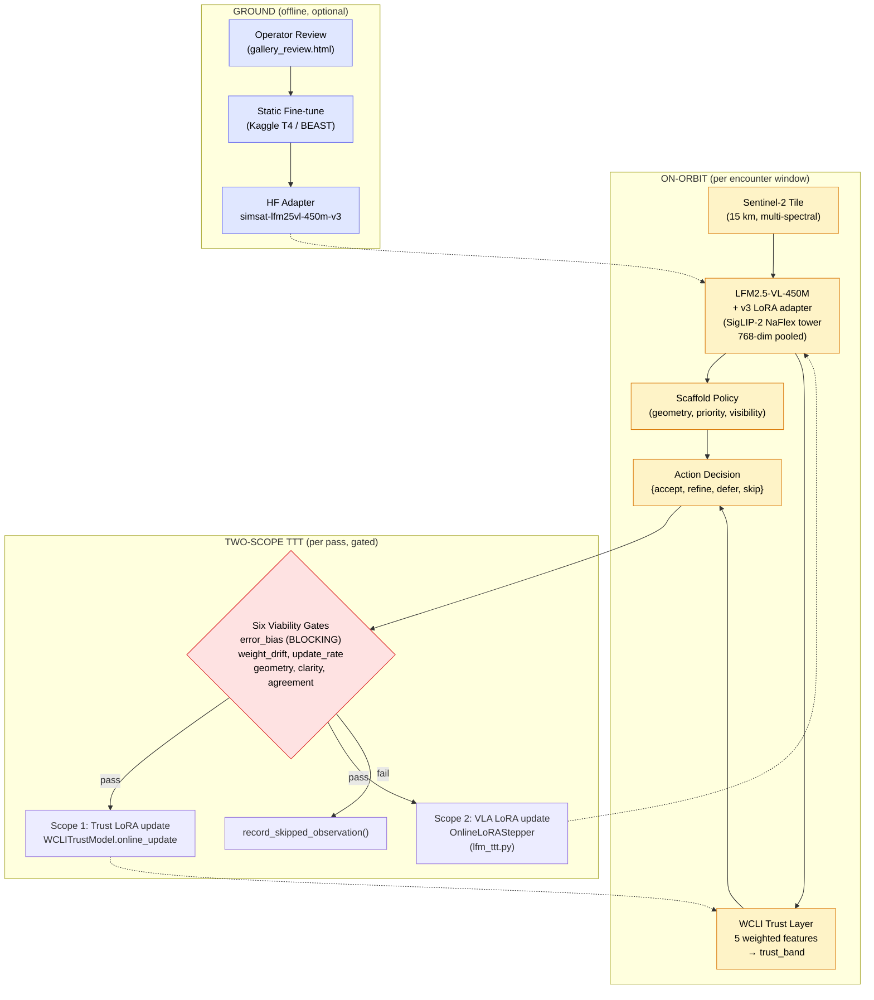

# SimSat Architecture — Diagram Source

This file contains a Mermaid + ASCII diagram suitable for rendering to a PNG
for the demo video and submission slide. Render the Mermaid block via:

- GitHub: just push this file — Mermaid renders inline.
- Local: `npx @mermaid-js/mermaid-cli -i ARCHITECTURE.md -o architecture.png` (or
  any Mermaid-aware tool).
- Online: paste the block into <https://mermaid.live> and download the SVG/PNG.

The intended end-state is `fig/architecture_diagram.png` for the README and
the demo-video frame at 0:20-0:50.

---

## Top-level dataflow (Mermaid)



---

## ASCII fallback (for terminal screencast)

```
┌──────────────────────────────────────────────────────────────────────────┐
│                      ON-ORBIT  (per encounter window)                     │
│                                                                          │
│  Sentinel-2 tile  ───►  LFM2.5-VL-450M + v3 LoRA  ───►  Scaffold Policy  │
│   (15 km, RGB+NIR)        (450M params, SigLIP-2)         (geometry,     │
│                            embed_dim=768                    priority,    │
│                            v3 holdout: 0.844 action)        visibility)  │
│                                  │                              │        │
│                                  ▼                              ▼        │
│                          WCLI Trust Layer  ─────────►  Action Decision   │
│                          (5 weighted feats)             {accept|refine   │
│                          → trust_band                    |defer|skip}    │
└──────────────────────────────────────┬───────────────────────────────────┘
                                       │
                                       ▼
┌──────────────────────────────────────────────────────────────────────────┐
│           TWO-SCOPE TTT  (per pass, gated by six viability filters)       │
│                                                                          │
│             error_bias (BLOCKING) │ weight_drift │ update_rate           │
│             geometry │ clarity │ agreement                                │
│                                  │                                       │
│           ┌──────────────────────┼──────────────────────┐                │
│           │ pass                 │ pass                 │ fail            │
│           ▼                      ▼                      ▼                │
│  Scope 1: Trust LoRA      Scope 2: VLA LoRA      record_skipped_         │
│  WCLITrustModel.          OnlineLoRAStepper       observation()          │
│  online_update            (lfm_ttt.py)                                   │
│  (5 weights drift)        (4.5M trainable params)                        │
│                                                                          │
│  Receipt (2026-05-07): 5/5 applied · 0 gates triggered ·                 │
│                        lora_delta_l2 0.0008→0.0021 · post-MAE perfect    │
└──────────────────────────────────────────────────────────────────────────┘
                                       │
                                       ▼  (optional, ground-side)
┌──────────────────────────────────────────────────────────────────────────┐
│                  GROUND  (offline, when round-trip permits)              │
│                                                                          │
│  gallery_review.html  ───►  Kaggle T4 / BEAST  ───►  HF Adapter          │
│  (operator labels)          5 epochs, lr=2e-4         (Apache-2.0)        │
│                             165 train rows            v3 canonical       │
└──────────────────────────────────────────────────────────────────────────┘
```

---

## Frame for the demo video

When recording the architecture frame at 0:20-0:50 of the video, use the
Mermaid PNG (top half + middle) on screen. Overlay the headline numbers as
a callout on the encoder box:

> **base 0.156 → tuned 0.844 action agreement (+68.8 pp)**
> **score MAE 0.365 → 0.055 (-31 pp)**

Cross-fade to the bottom half (TTT loop) when transitioning to the "this is
the runtime adaptation, not the static fine-tune" voiceover beat.
